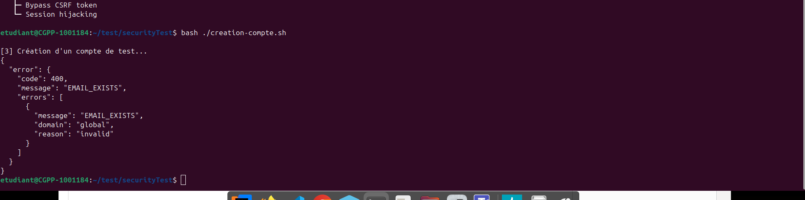

Développeur passionné qui aime créer des trucs qui fonctionnent bien et résoudre des problèmes concrets. Je travaille sur des projets variés, du backend performant aux interfaces web sympas, en passant par des expérimentations avec des moteurs de jeu et des émulateurs.

## Stack

Je m'adapte rapidement aux nouveaux langages et technologies selon les besoins du projet. J'aime apprendre et expérimenter avec différents outils.

### 🧠 Langages

## Compétences
- Architecture logicielle et design patterns (Décorateur, Adaptateur, Façade ...)
- Sécurité informatique et correction de vulnérabilités
- Développement web et interfaces utilisateur 
- Programmation bas niveau
- Graphisme et rendu 3D

## LeetCode Stats

